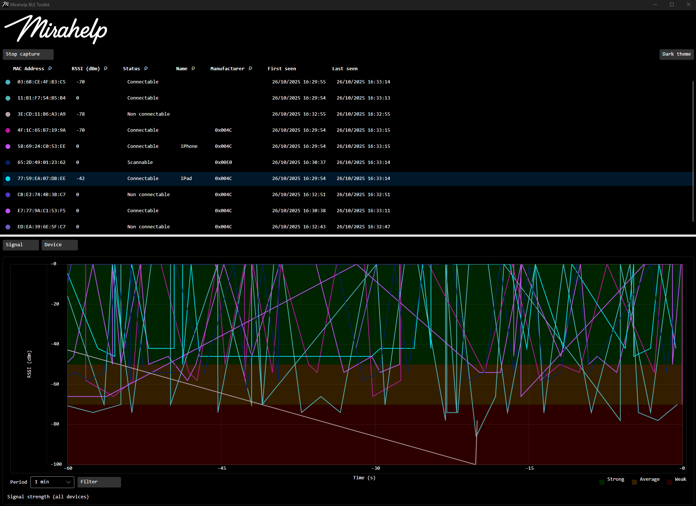
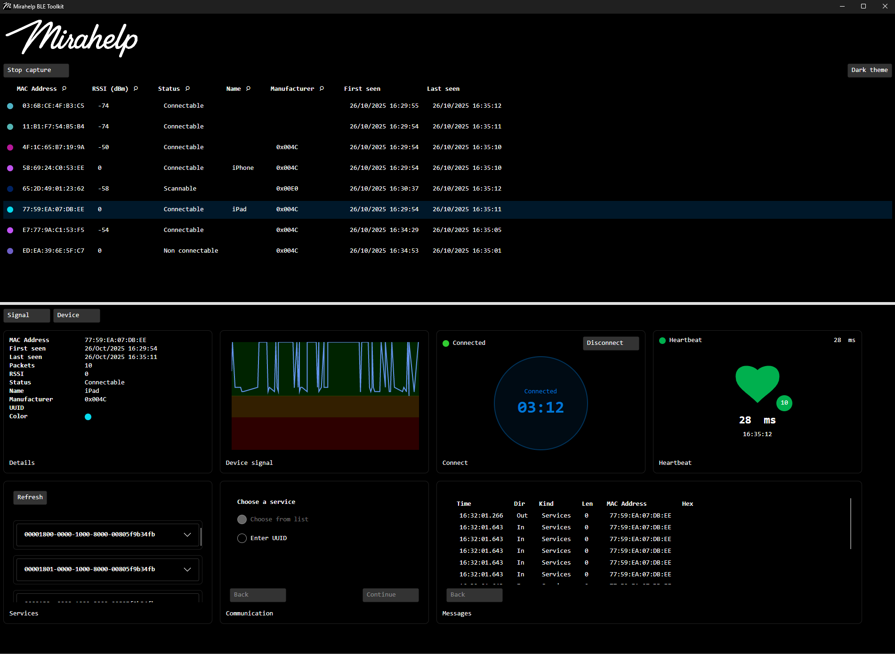
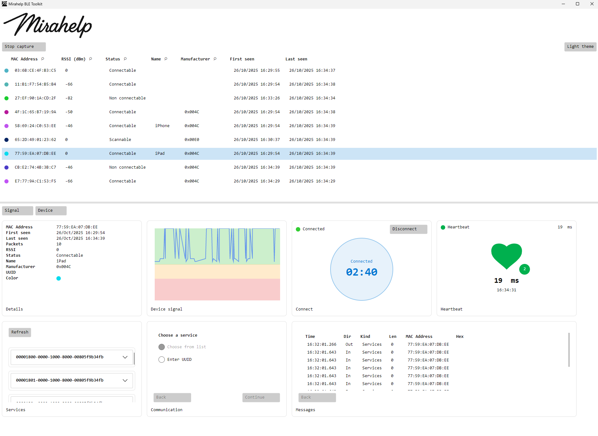
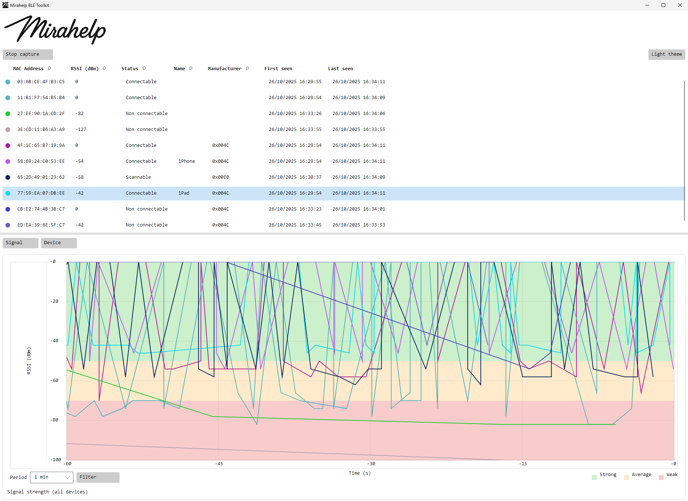

#  Mirahelp BLE Toolkit

# Showcase
   
 

# Description
A desktop Bluetooth Low Energy toolkit built with Avalonia and .NET 9. It offers device discovery, connection orchestration, GATT browsing, write/read workflows, heartbeat session checks, real‑time signal plots, and an in‑memory message log.

# Highlights
- Real‑time BLE device discovery
- Connection orchestrator
- GATT services and characteristics browser
- Write/Read wizard
- Device heartbeat
- Signal plots
- Message logs
- Dark and light theme toggle

# Quick Start
- Requirements
  - Windows 10/11 with Bluetooth LE hardware enabled
    - You must have Microsoft Bluetooth LE Enumerator in device manager under Bluetooth
  - .NET 9 SDK

[Releases](../../releases)

# Usage
- Start capture to begin scanning
- Pick a device in the table to open its dashboard
- Connect/Disconnect in the Connect panel
- Enable Heartbeat to track session health and latency
- Browse GATT services/characteristics
- Use Communication to run write/read/notify flows with Hex/UTF‑8/Base64 payloads
- View Packets for message history
- Right‑click on lists/plots for quick actions (copy, fetch, time window)
- Toggle theme from the main window

# Localization
- Place compiled `.mo` files at:
  - `Locales/<culture>/LC_MESSAGES/ui.mo`  
    Example: `Locales/en_US/LC_MESSAGES/ui.mo`
- The app uses the system UI culture if available, otherwise falls back to `en_US`.

# Notes
- Currently only supports Microsoft Windows.
- No telemetry. 
- All history is in memory.

# Roadmap
- Cross‑platform BLE implementation.
- More widgets.

# Contributing
PRs are welcome.

# License
See `LICENSE`.
